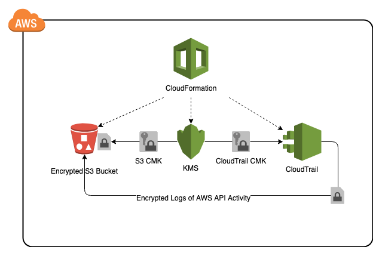

# aws-cloudtrail-cf-template

## Description:

This <a href="https://aws.amazon.com/cloudformation/" target="_blank">AWS CloudFormation</a> solution deploys <a href="https://aws.amazon.com/cloudtrail/" target="_blank">AWS CloudTrail</a>, a service for governance, compliance, operational auditing, and risk auditing of your AWS account. This AWS CloudFormation template creates <a href="https://aws.amazon.com/kms/" target="_blank">AWS KMS</a> encryption keys for CloudTrail and <a href="https://aws.amazon.com/s3/" target="_blank">S3</a>, and enables CloudTrail for the account.

CloudTrail logs are encrypted (AES-256) and stored in an encrypted (AES-256) S3 bucket that the CloudFormation template creates. For security and compliance it is important all AWS account activity is tracked and stored for tracking and analysis.

AWS CloudFormation provides a common language for you to describe and provision all the infrastructure resources in your cloud environment.

Using AWS CloudTrail, you can log, continuously monitor, and retain account activity related to actions across your AWS infrastructure. CloudTrail provides event history of your AWS account activity, including actions taken through the AWS Management Console, AWS SDKs, command line tools, and other AWS services. This event history simplifies security analysis, resource change tracking, and troubleshooting.

## AWS Resource Costs

As with most AWS services you will incur costs for usage. For this CloudFormation template the resources that incur costs are as follows

* Pricing:
   * <a href="https://aws.amazon.com/s3/pricing/" target="_blank">S3 pricing</a>
   * <a href="https://aws.amazon.com/kms/pricing/" target="_blank">KMS pricing</a>
   * <a href="https://aws.amazon.com/cloudtrail/pricing/" target="_blank">CloudTrail pricing</a>

## Prerequisites

* <a href="https://aws.amazon.com" target="_blank"> Amazon Web Services Account</a>
* <a href="https://aws.amazon.com/iam/" target="_blank">IAM</a> user with the following permissions:
   * AWSCloudFormationReadOnlyAccess
   * AWSCloudTrailFullAccess
   * AWSKeyManagementServicePowerUser
   * AmazonS3FullAccess

## CloudFormation Template

* The CloudFormation Template is available on GitHub:
   * <a href="https://github.com/getcft/aws-cloudtrail-cf-template" target="_blank">aws-cloudtrail-cf-template</a>

## Deploy the CloudFormation Template

* AWS Management Console

   * Login to *AWS Management Console*
   * Launch under *CloudFormation* your *cloudtrail-cf-template.yml* (included in this repo)

* CloudFormation Fields:

   * *Stack name* (Enter a name to associate to your AWS CloudTrail deployment)
   * Continue choosing *Next* and then *Create* (it may take several mintues to create resources)

## Results of the CloudFormation Template

In the *AWS Management Console* you should be able to *verify* the following have been created.

* Resources Created:
   * A CloudTrail KMS CMK encryption key
   * A S3 KMS CMK encryption key
   * An Encrypted S3 Bucket
   * A CloudTrail S3 Bucket Policy
   * CloudTrail enabled for the specific region with encrypted logs
